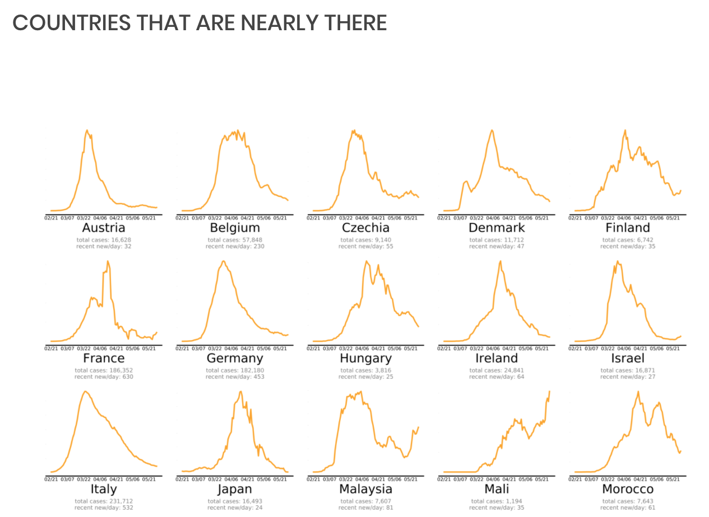
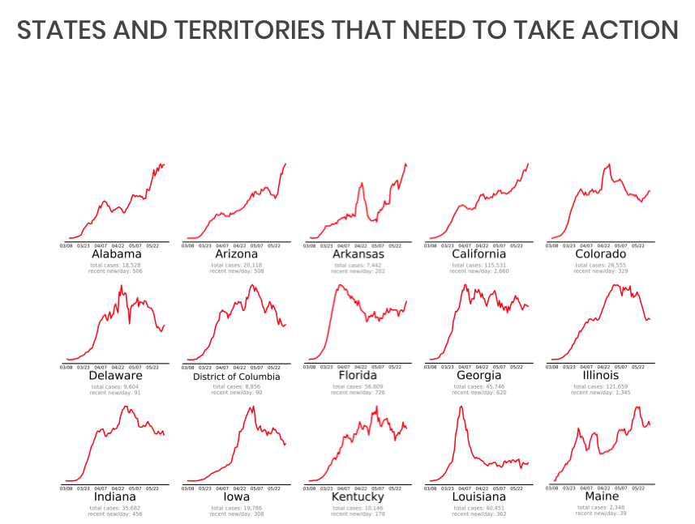
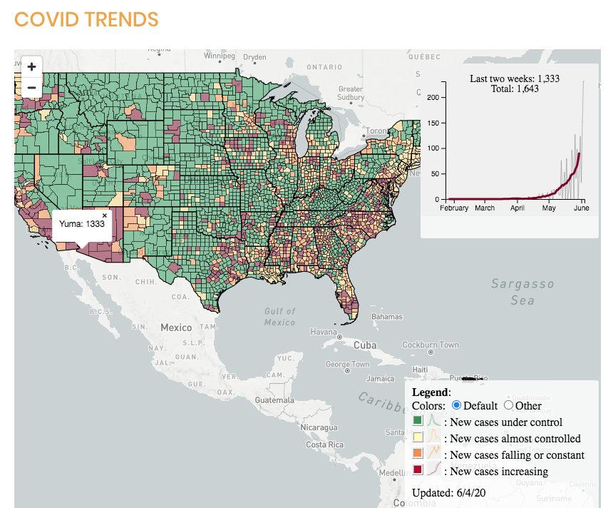
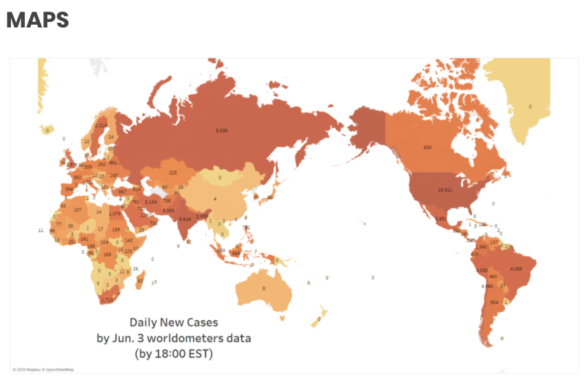
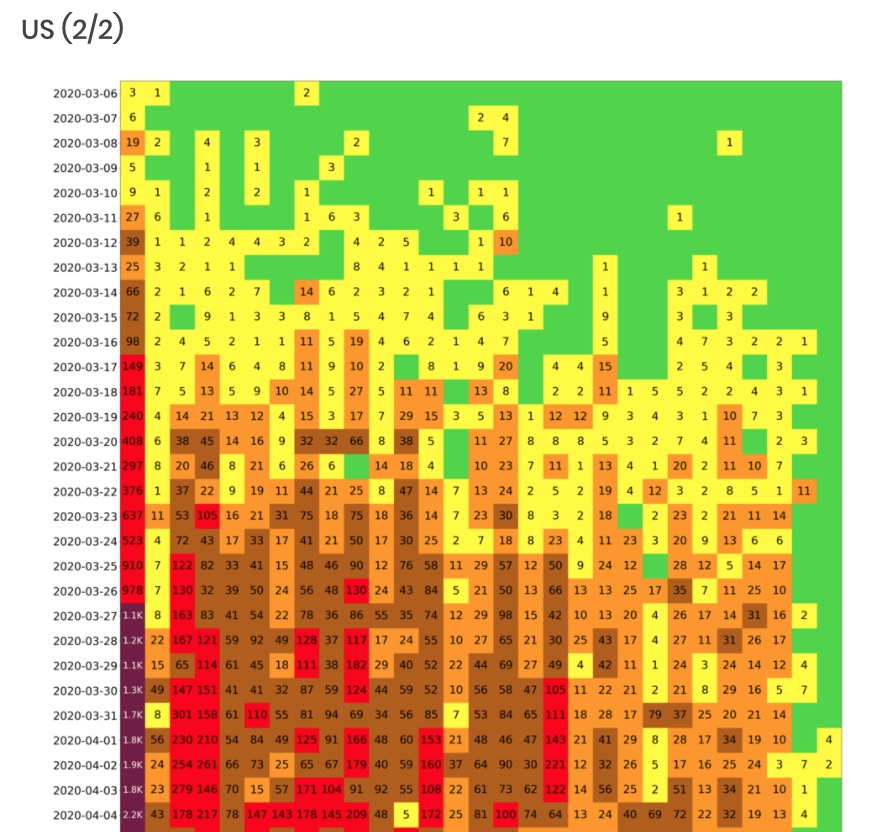
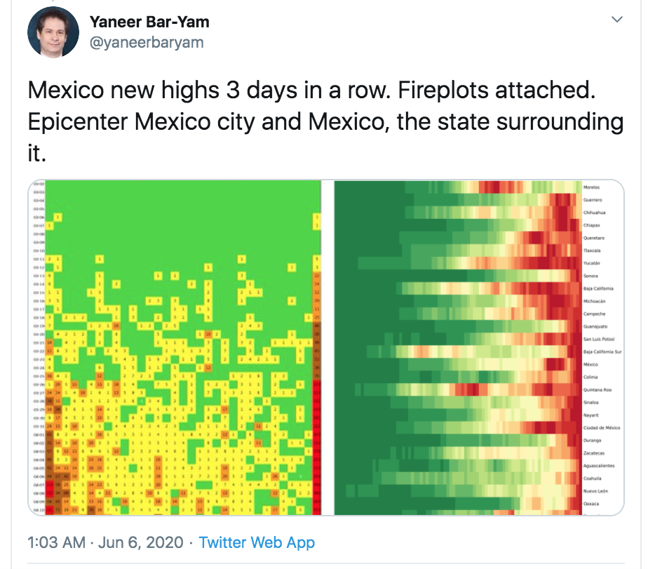
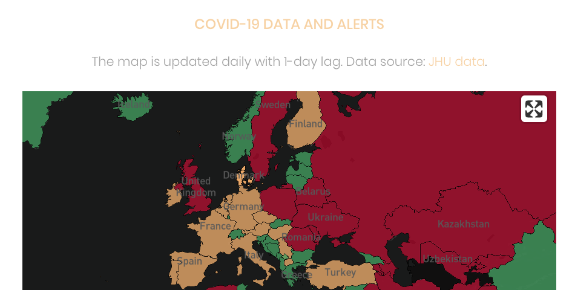

# ecv-analytics
EndCoronavirus.org analytics, live charts

Collection of charts and maps that are shown on https://www.endcoronavirus.org.
The website is hosted on SquareSpace.

**Goal: Get all maps and charts updated automatically once per day.**

## Countries

[endcoronavirus.org/countries](https://www.endcoronavirus.org/countries)

Screenshot:

- The charts are static images, served by SquareSpace 
- The curves are computed in ???
- The classification (Winning / Nearly there / Need action) is done manually???
- The charts are updated manually, from time to time???

## US States

[endcoronavirus.org/states](https://www.endcoronavirus.org/states)

Screenshot:

- The charts are static images, served by SquareSpace 
- The curves are computed in ???
- The classification (Winning / Nearly there / Need action) is done manually???
- The charts are updated manually, from time to time???

## US Counties

[endcoronavirus.org/us-counties](https://www.endcoronavirus.org/us-counties)

By Olha Buchel from the New England Complex Systems Institute 
and Joseph D. Ortiz from Kent State University, Department of Geology.

Screenshot:

- The maps use MapBox (terrain, city names) and D3, 
  in an IFrame that is served by [GitHub pages](https://obuchel.github.io/classification/classification_map.html).
- The charts are created dynamically from pre-computed JSON files.
- The curves and classification (Winning / Nearly there / Need action) are computed in 
  https://github.com/obuchel/classification.
  Data files are served by the same GitHub page 
  (see https://github.com/obuchel/classification/issues/4 for a proposal to migrate to Amazon S3).
- The charts are updated manually, once per day.

## Daily Update
[endcoronavirus.org/daily-update](https://www.endcoronavirus.org/daily-update)

By Chen Shen and Yaneer Bar-Yam, New England Complex Systems Institute.

Additionally, there are several charts (daily cases in India, Bangladesh, Pakistan)
and a fireplot for India.

- The charts and maps are static images, served by SquareSpace.
- The charts and maps are generated in ???
- The charts and maps are updated manually, from time to time???

## Fireplots

[endcoronavirus.org/fireplots](https://www.endcoronavirus.org/fireplots)

There are fireplots for many countries and US states.

- The plots are static images, served by SquareSpace.
- The plots are generated in ???
- The plots are updated manually, from time to time???

**Note:** Updates of these charts, as well as relative fireplot charts, are 
[posted to Twitter](https://twitter.com/yaneerbaryam/status/1269042291165081601)
from time to time.

## Global Maps

[endcoronavirus.org/map-visualization](https://www.endcoronavirus.org/map-visualization)

Screenshot:

The map has country boundaries plus US States and Canadian Provinces. 
It can be colored according to

- Classification ("Crushing the Curve"), new cases high / consistently falling / at or near zero.
- Change in confirmed cases / deaths / recovered
- Total confirmed cases / deaths / recovered

Tech:

- The map uses MapBox (terrain, city names) and D3, 
  in an IFrame that is served by [GitHub pages](https://obuchel.github.io/COVID-19_map/mapbox_es27.html).
- The charts are created dynamically from pre-computed JSON files.
- The curves and classification (Winning / Nearly there / Need action) are computed in 
  https://github.com/obuchel/COVID-19_map.
  Data files are served by the same GitHub page.
- The map is updated manually, once per day.

**Note:** There is a variation with popups at https://obuchel.github.io/COVID-19_map/mapbox_es27_popups.html. That contains a lot more charts, like mobility trends and moving averages. 
